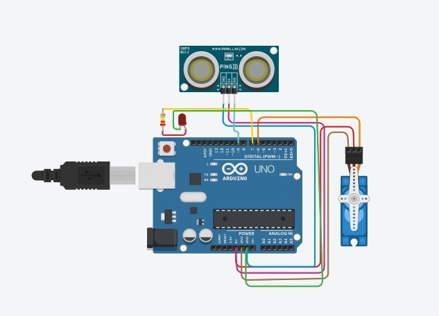
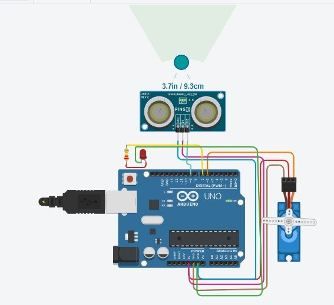
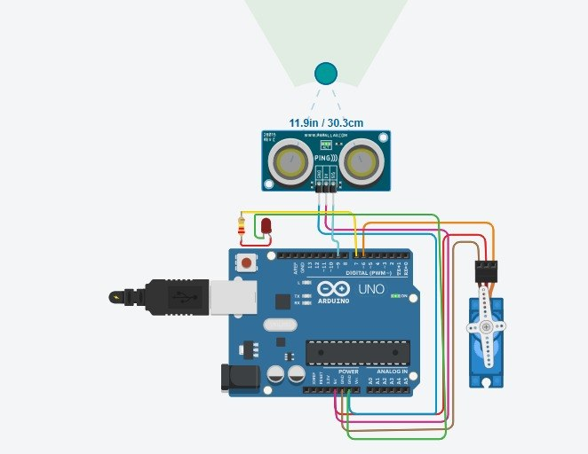

# Arduino Servo Control with Ultrasonic Sensor
Arduino project using an ultrasonic sensor to control a servo motor. The servo rotates when an object is within 10 cm and returns to its initial position when the object moves away

## Overview

This project controls a Servo Motor using an Ultrasonic Distance Sensor and an Arduino Uno.

When an object is detected at a distance of 10 cm or less (≤ 10 cm), the servo rotates to 90° and the LED turns ON. When the object moves farther than 10 cm, the servo returns to its initial position (**0°**) and the LED turns OFF.

---

## Components

- Arduino Uno
- Ultrasonic Distance Sensor
- Servo Motor
- LED
- Resistor
- Jumper Wires

---

## Project Features

- Detects objects using an ultrasonic sensor.
- Rotates the servo to 90° when an object is 10 cm or less from the sensor.
- Returns the servo to 0° when the object is more than 10 cm away.
- Turns the LED ON while the servo is activated and OFF when inactive.

---

## Simulation

The project was designed and tested using Tinkercad Circuits.

---

## Project Images

### Circuit Design

### Object Detected (≤ 10 cm)

### Object Away (> 10 cm)

---

## Author

Sarah Saud Alotaibi
